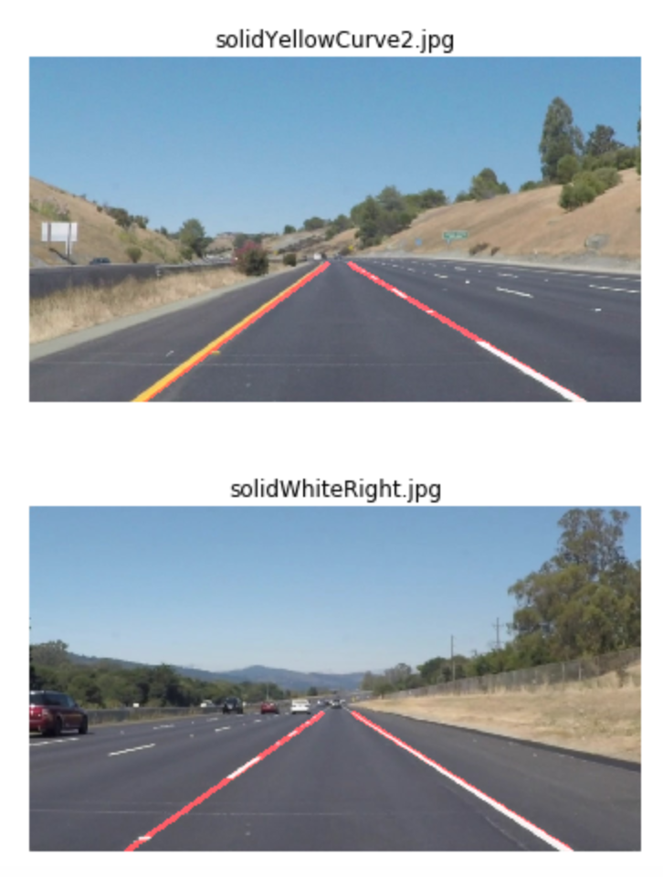

# Finding Lane Lines on the Road

The goals / steps of this project are the following:
* Make a pipeline that finds lane lines on the road
* Reflect on the work

### Reflection

### 1. Image processing pipeline and the modified `draw_lines()` function.

1. Convert image to gray scale (or other color space)
2. The Gaussian filter size is 3
3. Do Canny Edge with low_threashold = 100 and high_threashold = 250
4. Select area of intrest to find the lane lines
5. Draw lane lines with averaged slope from hough lines. 
    * The connected lane line is created by averaging the slope of hough lines. 
    * Starting points are chosen at the bottom of the image. The edning point is at 60% percent of the image height. 
    * Left lane slope and right lane slope is grouped by the positive/negative sign of the slope.
    * To increase the stablility of the code, an initial conditon is added before the canny edge line detection. It stabilize the line dranwn on the video temporally because less slope update is happening. However, the chosen values doesn't work well with the challegne problem that has a cuved lane lines.

### 2. Potential shortcomings of current pipeline

1. The lane lines are jumpy while applied on videos
2. The lane lines tend to fail when there are shadows on the road. 

### 3. Possible improvements to your pipeline

1. Adding slope-updating criteria to make the lane line more stable temporally. (something like: if delta m between previous frame and current frame > a certain number: do* 0.5* previous_frame_slope + 0.5*current_frame_slope)
2. I didn't really make the challenge problem work in this submission. The line shows up at the wrong location becasue the linear fitting and the initial condition I chose. If the fitted curved is changed to polynominal, it should stay on the correct lane line location. 

